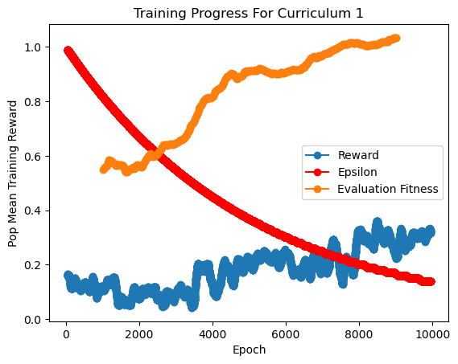
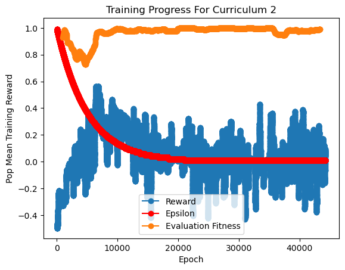

# Connect4RL

This repo holds code for a multi-agent RL model for playing connect4 that is trained with curriculum learning

### About training the model...

I trained this model on the Connect4 PettingZoo out of the box environment (found [here](https://pettingzoo.farama.org/environments/classic/connect_four/))

I trained it using a DQN developed in AgileRL (found [here](https://docs.agilerl.com/en/latest/api/algorithms/dqn.html#dqn))

The first curriculum I trained the model on (can be found as lesson1.yml). Here I train the model against a randomly-picking opponent (10,000 games)

The model's evaluation significantly increased over training, but did not converge

In the second curriculum (can be found as lesson2.yml). I trained the model to play against itself (50,000 games)

The model performed very well in evaluation

### Visualizing The model playing Connect 4

Here's an example of the current iteration of the agent (red) beating a randomly picking agent (black)

And an example of the agent playing against itself

